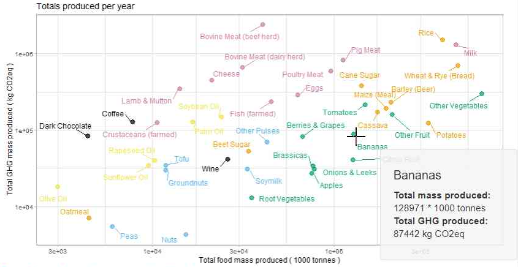

# Greenhouse gas emissions of food over the supply chain
Visualize the environmental impact of food products at each stage of production.

## Table of contents
* [Description](#description)
* [Usage](#usage)
* [To do](#to-do)
* [References](#references)
* [Author](#author)

## Description
Personal project under active development.

This interactive app investigates the environmental impacts of food products and supply chain processes, by exploring the greenhouse gas emissions of different types of food at different stages of production.

My goals for the project are to learn about food's environmental impacts, and improve my skills in:
* data manipulation with dplyr
* interactive data visualization
* RShiny app development

## Screenshots

## Usage
Run `app.R` to build the app and show interactive plots.

## To do
* Get scaling of y-axis on stages plot working
* Put tooltips on stages plot
* When hovering over a point (on the totals plot) or a line (on the stages plot), highlight the corresponding line or point on the other plot
* Colour buttons for food types to match plot colours
* Improve aesthetics of layout
* Streamline code, especially how the various dataframes are generated/manipulated

## References
Data is from table S2 in: 
[Reducing food's environmental impacts through producers and consumers.](https://science.sciencemag.org/content/360/6392/987.full) J. Poore, T. Nemecek. Science 2018-06-01: 987-992.

## Author
Created by Heather More